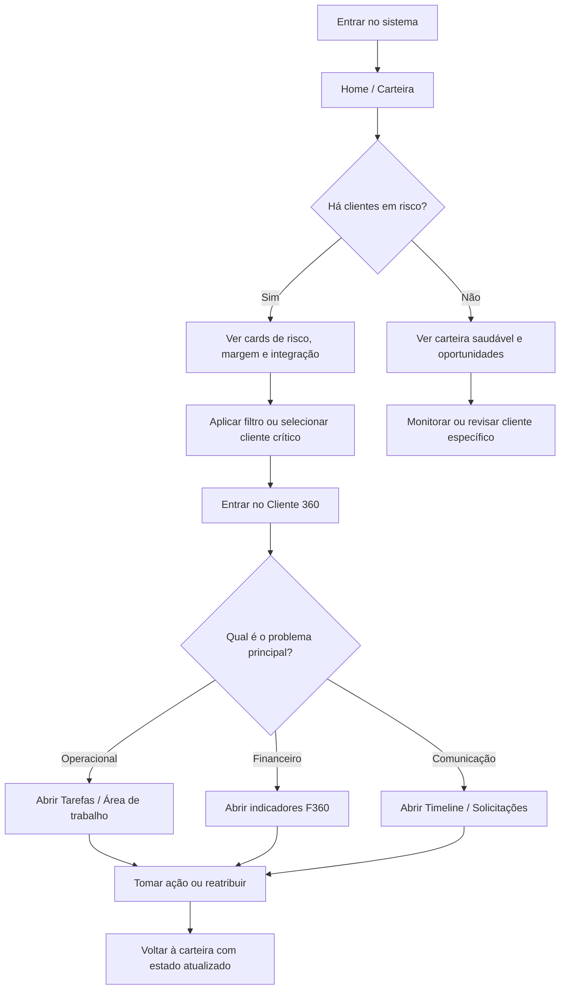
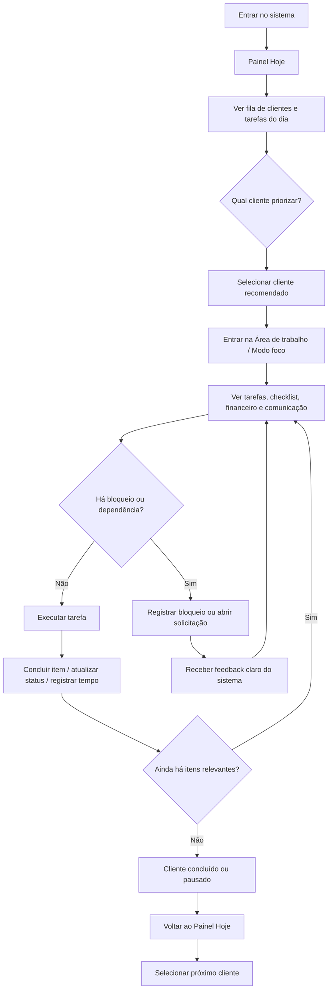

---
stepsCompleted:
  - step-01-init
  - step-02-discovery
  - step-03-core-experience
  - step-04-emotional-response
  - step-05-inspiration
  - step-06-design-system
  - step-07-defining-experience
  - step-08-visual-foundation
  - step-09-design-directions
  - step-10-user-journeys
  - step-11-component-strategy
  - step-12-ux-patterns
  - step-13-responsive-accessibility
  - step-14-complete
lastStep: 14
inputDocuments:
  - _bmad-output/planning-artifacts/product-brief-BPO_MANAGER-2026-03-13.md
  - _bmad-output/planning-artifacts/prd.md
  - _bmad-output/planning-artifacts/prd-validation-report.md
  - _bmad-output/planning-artifacts/bpo360-information-architecture.md
---

# UX Design Specification BPO_MANAGER

**Author:** Tiago  
**Date:** 2026-03-13

---

<!-- UX design content will be appended sequentially through collaborative workflow steps -->

## Executive Summary

### Project Vision

O BPO360 (BPO_MANAGER) é a plataforma operacional do BPO financeiro, desenhada para substituir o mosaico atual de planilhas, WhatsApp, e-mails e ERPs genéricos por um fluxo único e opinado. A visão de produto é ser o “sistema nervoso” do escritório: concentrar tarefas, rotinas, comunicação, documentos e indicadores financeiros em uma experiência web única, fortemente integrada ao F360, permitindo que gestores acompanhem saúde da carteira e rentabilidade por cliente enquanto operadores executam o dia a dia com menos atrito e mais foco.

### Target Users

- **Gestor de operação de BPO financeiro**: precisa acompanhar rapidamente saúde da carteira (tarefas, risco, integrações, margem) e agir em cima de clientes críticos. Usa principalmente as visões de dashboard geral, lista de clientes e Cliente 360 para decidir onde intervir.
- **Operador/analista de BPO**: responsável por executar rotinas diárias (lançamentos, conciliações, cobranças, fechamento). Busca um painel “Hoje” claro e um modo foco que reduza alternância entre clientes e consolide checklist, dados F360 e timesheet em uma única tela.
- **Sócio/dono do escritório** (secundário): não opera no dia a dia, mas é impactado por relatórios de produtividade e rentabilidade, e pela percepção de organização e segurança na operação.
- **Cliente final (lojista / responsável financeiro)**: usa o portal para enviar documentos, acompanhar pendências e responder solicitações, saindo do fluxo fragmentado em WhatsApp/e-mail para um canal único com status visível.

### Key Design Challenges

- **Orquestrar muita informação em poucas superfícies críticas** (Home, Cliente 360, Modo Foco) sem gerar sobrecarga cognitiva, mantendo clara a hierarquia entre indicadores, tarefas e próximos passos.
- **Atender papéis muito distintos dentro do mesmo produto web**, garantindo que cada perfil veja primeiro o que importa para seu trabalho (gestor vs operador vs cliente vs admin) sem confusão de navegação.
- **Representar estados da integração F360 e da “frescura” dos dados** de forma compreensível para usuários de negócio, traduzindo erros técnicos e defasagem de sync em mensagens e padrões visuais claros.
- **Fazer do modo foco uma experiência realmente melhor que o fluxo atual**, incentivando uso consistente e reduzindo alternância improdutiva entre clientes.

### Design Opportunities

- **Transformar a Home e a visão Cliente 360 em painéis de decisão de alta clareza**, com foco em risco, prioridade e ações rápidas, em vez de apenas dashboards informativos.
- **Usar o modo foco como diferencial de produtividade**, com layout enxuto, microinterações e atalhos que façam o operador sentir que “trabalha mais rápido e com menos cansaço” dentro do BPO360.
- **Explorar a timeline unificada e a central de solicitações/documentos como memória viva do cliente**, facilitando onboarding de novos analistas e reduzindo dependência de conhecimento tácito.
- **Trabalhar cuidadosamente microcopy e estados visuais relacionados à integração F360**, transformando um ponto potencialmente frágil (integração) em uma sensação de confiabilidade e transparência para gestores.

## Core User Experience

### Defining Experience

O coração do BPO360 é o operador começando o dia no painel **Hoje**, escolhendo um cliente e entrando em **modo foco** para executar e concluir as tarefas daquela empresa com o mínimo de alternância possível. O valor do produto aparece quando o operador sente que consegue “varrer o dia” de um cliente em uma só tela — checklist, dados financeiros do F360 e registro de tempo — sem precisar pular entre múltiplos sistemas e abas. Em paralelo, para o gestor, a experiência central é abrir a Home / carteira de clientes e, em poucos segundos, identificar quais CNPJs exigem atenção (risco operacional, financeiro ou de margem) e entrar no detalhe do Cliente 360 para decidir o que fazer.

### Platform Strategy

O BPO360 é um **web app desktop-first**, pensado para uso intenso em ambiente de trabalho com mouse e teclado. As principais telas (Home, Clientes, Cliente 360, Hoje, Modo Foco, Integrações, Timesheet, Monitoramento) são otimizadas para monitores ≥ 1024px, com responsividade suficiente para tablets, mas sem foco em experiências mobile “on the go” neste estágio. Interações de alta frequência (navegação de listas, mudança de cliente, marcar checklist, iniciar/parar tempo) devem ser confortáveis com mouse, mas também com atalhos de teclado onde fizer sentido para operadores power users.

### Effortless Interactions

Algumas interações precisam ser praticamente sem esforço: o operador deve bater o olho no painel Hoje e entender imediatamente “qual cliente e qual tarefa fazer agora”; entrar e sair do modo foco deve ser rápido e previsível; marcar passos de checklist e registrar tempo não pode exigir mais do que poucos cliques ou atalhos diretos. Para o gestor, filtrar a carteira por risco ou margem e localizar clientes problemáticos precisa ser tão simples quanto aplicar 1–2 filtros intuitivos. Estados da integração F360 (atualizado, desatualizado, com erro) devem ser comunicados com rótulos e cores claras, evitando jargão técnico.

### Critical Success Moments

Momentos-chave que definem a experiência incluem: a primeira sessão de modo foco em que o operador percebe que não precisa mais alternar entre ERP, planilhas e WhatsApp para concluir o dia de um cliente; a primeira reunião de gestão em que a Home / Clientes expõe de forma óbvia quais contratos estão em risco ou rendendo abaixo da margem alvo; e situações em que a integração com o F360 falha ou está atrasada, mas o usuário entende rapidamente a causa e as ações possíveis, sem sensação de “sistema quebrado”. O onboarding desses fluxos — primeiras vezes — precisa ser guiado o suficiente para garantir sucesso logo nas primeiras sessões.

### Experience Principles

- **Foco guiado, um cliente por vez**: a UI ajuda o operador a manter contexto de um único cliente e suas tarefas até conclusão ou pausa explícita, reduzindo alternância desnecessária.
- **Estado sempre visível e interpretável**: tarefas, tempo, risco, saúde da integração e rentabilidade devem ter estados visuais e textos que qualquer usuário de negócio compreenda.
- **Fluxos opinados com próxima melhor ação**: em vez de apenas listar dados, as telas principais apontam o que o usuário deve fazer em seguida (próxima tarefa, próximo cliente em risco, próxima ação em caso de erro de integração).
- **Baixa fricção em ações repetitivas**: tudo o que é executado dezenas de vezes por dia (checklists, timesheet, navegação entre clientes e filtros) deve ser projetado para mínimo de passos e boa ergonomia de mouse/teclado.

## Desired Emotional Response

### Primary Emotional Goals

O BPO360 deve fazer operadores e gestores se sentirem **no controle, calmos e produtivos**, com a sensação de que “finalmente a operação está organizada em um lugar só”. Para o operador em modo foco, o objetivo é chegar em um **quase estado de fluxo**: ritmo estável de execução, baixa carga mental e satisfação de ir concluindo tarefas de um cliente por vez. Para o gestor, o produto deve transmitir **alerta e urgência controlada** — enxergar riscos com clareza, mas em um painel que passa confiança de que é possível agir sem pânico.

### Emotional Journey Mapping

- **Primeiro contato**: curiosidade e alívio inicial ao perceber que tarefas, clientes, integrações e indicadores não estão mais espalhados em planilhas e WhatsApp.
- **Durante o uso diário (operador)**: sensação crescente de foco e fluidez — o usuário entra em modo foco e sente que consegue “varrer o dia” de um cliente em um fluxo contínuo, sem se perder.
- **Durante o uso diário (gestor)**: percepção de cockpit organizado — ver rapidamente clientes em risco, margens apertadas e status de integrações, com a tranquilidade de que há caminhos claros de ação.
- **Ao concluir tarefas / fechar o dia**: sentimento de **accomplishment** (“entreguei o que precisava”) mais forte que cansaço ou frustração.
- **Quando algo dá errado (integração, erro de sistema)**: o sistema deve amortecer ansiedade, comunicando o problema com clareza, explicando impacto e próximo passo, sem gerar sensação de caos.
- **Retorno recorrente ao produto**: expectativa positiva de eficiência (“sei que aqui eu consigo tocar a operação”) em vez de peso ou resistência.

### Micro-Emotions

- **Confiança > Ceticismo**: confiança de que dados de tarefas, tempo e F360 são atuais e interpretáveis; o usuário não sente necessidade de “conferir tudo duas vezes” em outro lugar.
- **Calma focada > Ansiedade**: no modo foco e na visão de carteira, o layout e os estados visuais devem reduzir ruído e evitar sobrecarga, apoiando decisões sem pressa artificial.
- **Accomplishment > Frustração**: cada tarefa concluída, checklist fechado ou cliente “limpo” no dia reforça a sensação de progresso real, não de roda-viva.
- **Previsibilidade > Surpresa negativa**: o produto deve se comportar de forma consistente — mudanças de estado, filtros, navegação e feedback não pegam o usuário de surpresa.
- **Emoção a evitar (explícita)**: **ansiedade** — principalmente em dashboards muito carregados, mensagens de erro técnicas ou comportamentos inesperados.

### Design Implications

- Para suportar **estado de fluxo do operador**, o modo foco deve ter visual limpo, poucas distrações, atalhos claros (teclado/mouse) e feedback imediato em cada ação (concluir subitem, registrar tempo, avançar para próxima tarefa).
- Para entregar **alerta e urgência controlada ao gestor**, os dashboards devem priorizar poucos sinais fortes (clientes em risco, integrações problemáticas, margens baixas), com cores e hierarquias visuais que chamem atenção sem poluição.
- Para reduzir **ansiedade em erros e integrações**, mensagens devem explicar o que aconteceu, impacto nos dados e próximos passos em linguagem de negócio, com componentes visuais que indiquem severidade sem dramatização.
- Para reforçar **confiança**, estados de sincronização, datas de última atualização, filtros ativos e escopos (qual cliente, qual período, qual carteira) precisam estar sempre visíveis e inequívocos.
- Para promover **accomplishment**, microinterações (animações sutis, confirmações claras, mudanças de estado visuais) ao concluir tarefas ou “zerar” o dia de um cliente devem ser perceptíveis, mas não barulhentas.

### Emotional Design Principles

- **Nenhuma decisão no escuro**: sempre mostrar contexto suficiente (estado, escopo, impacto) para que o usuário não precise adivinhar o que está acontecendo.
- **Alertas que convidam à ação, não ao pânico**: todo estado de risco ou erro vem acompanhado de um caminho de ação claro e textual.
- **Fluxo acima de urgência artificial**: o produto prioriza ritmo constante e previsível de trabalho em vez de sons, pop-ups ou notificações que quebrem o foco.
- **Clareza visual contra ansiedade**: uso disciplinado de cor, tipografia e densidade de informação para evitar dashboards que “gritam” ou confundem.
- **Erros como parte do fluxo, não como colapso**: qualquer falha (integração, validação, exceção) é tratada com mensagens calmas, opções claras e possibilidade de recuperação.

## UX Pattern Analysis & Inspiration

### Inspiring Products Analysis

- **Linear (Gestão de Tarefas e Projetos)**  
  Linear mostra como uma interface **minimalista e ultra-rápida**, com forte suporte a **atalhos de teclado**, pode transformar gestão de tarefas em uma experiência quase de “linha de comando visual”. A navegação é previsível, o foco é sempre na lista atual e criar/concluir tarefas exige pouquíssimos passos, o que reduz drasticamente fricção para usuários de alto volume.

- **Pennylane (Sistema Financeiro e Contábil)**  
  A Pennylane consegue unificar **finanças e contabilidade em um único ambiente**, com navegação muito clara entre módulos e visão compartilhada entre escritório e cliente. O design é limpo, consistente e transmite confiança, tornando mais fácil entender onde estou, que contexto estou vendo (empresa, período, tipo de dado) e como colaborar em tempo quase real sem se perder.

- **Karbon (Gestão para Escritórios Contábeis)**  
  O Karbon se destaca pela visão de **“Triagem” (Triage)**, que organiza a comunicação caótica com clientes ao transformar e-mails e solicitações em **tarefas acionáveis** de forma fluida. A UX foca em tirar o usuário da caixa de e-mail e levá-lo para uma fila clara de trabalho, conectando mensagens a responsáveis, prazos e workflows.

### Transferable UX Patterns

- **Navigation Patterns**
  - **Layout tipo app de produtividade (Linear)**: barra lateral para áreas principais + conteúdo focado à direita, adequado para o shell `/app` do BPO360 (Home, Clientes, Hoje, Integrações, Timesheet, Admin).
  - **Contexto sempre explícito (Pennylane)**: destacar claramente qual cliente, período e tipo de visão está ativa, aplicado às telas de Cliente 360, Financeiro (F360) e Timesheet.
  - **Fila de trabalho triada (Karbon)**: visão estilo “inbox/triagem” para solicitações e painel Hoje, onde mensagens/inputs viram tarefas organizadas.

- **Interaction Patterns**
  - **Atalhos de teclado para power users (Linear)**: criar tarefa, mudar status, navegar entre clientes e entrar em modo foco com poucos atalhos consistentes.
  - **Transformar comunicação em trabalho (Karbon)**: ações rápidas em cima de solicitações (converter em tarefa, atribuir, definir prazo) diretamente na interface de triagem.
  - **Drill-down suave a partir de cards financeiros (Pennylane)**: clicar em cards/resumos de indicadores F360 levando para listas filtradas relacionadas, sem quebrar o contexto.

- **Visual Patterns**
  - **Minimalismo orientado a conteúdo (Linear)**: remover elementos decorativos e priorizar listas, estados e hierarquia tipográfica, algo crítico para o modo foco e o painel Hoje.
  - **Design contábil que transmite confiança (Pennylane)**: uso disciplinado de cor, espaços, tipografia e iconografia para reduzir ansiedade em telas financeiras e de integração.
  - **Status e prioridades claramente codificados (Karbon/Linear)**: uso consistente de cores/labels para prioridade, risco e status de tarefas/solicitações.

### Anti-Patterns to Avoid

- **Sobrecarregar dashboards com widgets demais**: telas iniciais que tentam mostrar “tudo ao mesmo tempo”, gerando ansiedade e fazendo o usuário ignorar a maioria dos blocos.
- **Comunicação e tarefas desconectadas**: permitir que solicitações fiquem isoladas da fila de trabalho, forçando o usuário a gerenciar e-mail/chat e tarefas em silos.
- **Navegação ambígua entre clientes e contextos**: mudar de empresa, período ou filtro sem deixar isso extremamente visível, causando erros operacionais em dados financeiros.
- **Atalhos obscuros sem suporte visual**: exigir uso pesado de teclado sem affordances (tooltips, menus de ajuda rápida), o que afasta usuários menos avançados.

### Design Inspiration Strategy

- **What to Adopt**
  - Do **Linear**, adotar a ideia de uma interface rápida, focada e previsível para listas de trabalho (Hoje, Modo Foco, Tarefas por cliente), com suporte consistente a atalhos.
  - Do **Pennylane**, adotar a clareza de navegação entre módulos e a forma como contexto financeiro/contábil é apresentado de forma legível e confiável.
  - Do **Karbon**, adotar uma visão clara de **triagem** que transforma comunicação com clientes em tarefas rastreáveis na operação.

- **What to Adapt**
  - Adaptar o minimalismo radical do Linear ao contexto de BPO financeiro, garantindo que, mesmo limpo, o layout ainda exiba estados críticos (riscos, integrações, prazos) de forma visível.
  - Adaptar o modelo de inbox/triagem do Karbon para contemplar não só e-mails, mas também solicitações, documentos e alertas de integração vindos do F360.

- **What to Avoid**
  - Evitar copiar complexidade visual de ERPs tradicionais que misturam muitos conceitos na mesma tela, indo contra os objetivos de calma e foco.
  - Evitar padrões que reforcem ansiedade (dashboards poluídos, mensagens de erro agressivas, mudanças de estado pouco previsíveis), mesmo que comuns em ferramentas financeiras.
  
## Design System Foundation

### 1.1 Design System Choice

O BPO360 terá um **Design System 100% custom**, criado especificamente para operação de BPO financeiro, inspirado em padrões modernos de produtividade (Linear), confiança financeira (Pennylane) e gestão de escritórios (Karbon), mas sem depender visualmente de nenhum sistema existente como Material ou Ant. A base serão tokens próprios de marca e um conjunto de componentes desenhados sob medida para painéis de carteira, modo foco, finanças F360 e triagem de comunicação.

### Rationale for Selection

- **Identidade forte e defensável**: como produto estratégico para operação interna e futura oferta SaaS, um design system próprio evita “cara de ERP genérico” e reforça o posicionamento premium do BPO360.
- **Ajuste fino ao domínio**: telas densas (clientes, tarefas, financeiro, timesheet) exigem decisões específicas de densidade, hierarquia e uso de cor que nem sempre se encaixam bem em sistemas genéricos.
- **Escalabilidade futura**: um DS custom permite crescer para novos módulos (mobile, white-label cliente final, múltiplos ERPs) mantendo consistência visual e de interação sem ficar preso a limitações de terceiros.
- **Liberdade para combinar referências**: podemos trazer o foco e velocidade do Linear, a linguagem de confiança da Pennylane e o modelo de triagem do Karbon sem “herdar” decisões de UI que não façam sentido aqui.

### Implementation Approach

- **Tokens de design proprietários**:
  - **Cores**: paleta primária do BPO360 (ex.: tons de azul/teal para confiança e ação), paleta de suporte (sucesso, aviso, erro, info) e escala de cinzas para estruturar dashboards sem ruído.
  - **Tipografia**: escolha de 1–2 famílias (sans-serif moderna) com mapa claro de hierarquias (Título de página, seção, cards, labels, números financeiros).
  - **Espaçamentos e grid**: sistema de espaçamento (4/8/12/16 px) e grid responsivo focado em desktop, garantindo consistência entre listas, tabelas, cards e formulários complexos.
  - **Raios, bordas e sombras**: definição de um “visual language” consistente (quão arredondado, quando usar sombra vs. borda, profundidade entre níveis de informação).
- **Biblioteca de componentes base**:
  - **Shell de app**: header fixo com contexto (cliente/período/usuário), side-nav com seções principais e área central modular.
  - **Listas/tabelas densas**: componentes otimizados para alto volume (Clientes, Tarefas, Timesheet, Logs), com estados (loading, vazio, erro, selecionado) padronizados.
  - **Cards de indicadores**: cards financeiros e de risco com hierarquia numérica clara e affordances de drill-down.
  - **Filtros e chips**: filtros persistentes e chips de estado/prioridade reutilizáveis em clientes, tarefas, integrações e relatórios.
  - **Form inputs e diálogos**: padrões únicos para campos, validações, modais e side panels (ex.: configuração F360, edição em massa).
  - **Feedback**: toasts, banners e mensagens inline definidas por severidade e alinhadas aos objetivos emocionais (sem pânico).
- **Documentação em Figma desde o início**:
  - Criação de um arquivo de **Design System BPO360** com páginas para tokens, componentes, padrões de layout e exemplos de telas (Home, Hoje, Modo Foco, Cliente 360, Integrações).

### Customization Strategy

- **Refinamento progressivo guiado pelos fluxos principais**:
  - Primeiro, desenhar em Figma componentes e tokens necessários para: Home gestor, Painel Hoje, Modo Foco, Cliente 360 e Integrações F360.
  - Em seguida, expandir o DS para módulos de comunicação (solicitações, documentos), timesheet e monitoramento.
- **Linguagem visual orientada a calma e foco**:
  - Uso de cor principalmente para estados e ações importantes; estruturas e fundos em neutros para evitar ansiedade em dashboards.
  - Destaque visual muito claro para “o que fazer agora” (próximas tarefas, clientes em risco, erros de integração) sem poluir o resto da interface.
- **Preparação para implementação tecnológica**:
  - Definir tokens em formato que possa ser traduzido facilmente para `design tokens` (JSON/YAML) consumidos por frontend.
  - Documentar variações de densidade (normal vs. compacta) para componentes críticos, pensando em operadores que passam o dia na ferramenta.

## 2. Core User Experience

### 2.1 Defining Experience

A experiência definidora do BPO360 não é simplesmente “gerenciar tarefas” nem “ver indicadores”. É a sensação de que o usuário consegue entrar no sistema, identificar rapidamente onde agir e operar um cliente de ponta a ponta sem perder contexto.

Em termos práticos, a interação que precisa ficar memorável é:

**“Escolher um cliente prioritário e resolver o dia dele em um workspace focado, com contexto operacional, financeiro e comunicacional na mesma superfície.”**

Esse é o momento em que o produto deixa de parecer um ERP genérico ou uma lista de tarefas e passa a parecer um cockpit operacional de BPO. Se essa experiência estiver certa, o restante da navegação, os dashboards e os módulos complementares passam a fazer sentido como suporte a essa ação principal.

Para o gestor, a versão dessa mesma experiência é semelhante: bater o olho na carteira, localizar clientes em risco e mergulhar imediatamente no ponto certo de intervenção. Para o operador, é entrar em fluxo e “limpar” o trabalho de um cliente sem alternância caótica entre telas, planilhas, ERP e mensagens.

### 2.2 User Mental Model

Hoje, o usuário resolve esse problema montando um mosaico mental entre ERP, planilhas, WhatsApp, e-mail e memória operacional. O modelo mental atual não é “usar um sistema único”, mas sim “caçar contexto em vários lugares e então executar”.

Isso gera três expectativas fortes:

- o usuário espera ver rapidamente o que é urgente;
- o usuário espera manter contexto de cliente sem precisar reconstruir a situação toda vez;
- o usuário espera que o sistema mostre o próximo passo, não apenas dados.

O que mais frustra no modelo atual é a alternância: trocar de cliente, trocar de aba, trocar de canal e perder a linha de raciocínio. O que o usuário quer não é mais informação; é mais continuidade operacional.

Nas telas atuais do projeto, isso já aparece como oportunidade clara:
- `tarefas/hoje` aponta para uma fila do dia;
- `area-de-trabalho` já sugere um workspace em colunas;
- `clientes` já funciona como carteira navegável.

O problema é que essas superfícies ainda não estão conectadas por uma narrativa visual única. O usuário vê páginas funcionais, mas ainda não sente um fluxo de operação contínuo.

### 2.3 Success Criteria

A experiência central será bem-sucedida quando o usuário sentir que o sistema “organiza o dia por ele” e reduz a necessidade de traduzir mentalmente o estado da operação.

Os principais indicadores de sucesso dessa experiência são:

- o usuário entende em poucos segundos qual cliente ou tarefa merece atenção;
- ao entrar em um cliente, o sistema preserva contexto suficiente para executar sem caça de informação;
- o progresso fica visível e recompensador, com sensação de avanço real;
- status, prioridades, risco e integração são compreendidos sem leitura excessiva;
- a tela parece rápida, previsível e calma, mesmo quando há muita informação.

**Success Indicators:**
- O operador consegue começar a trabalhar em um cliente em menos de 1 minuto após abrir a aplicação.
- O gestor identifica clientes críticos e acessa o detalhe certo sem percorrer múltiplas telas intermediárias.
- Cada ação relevante gera feedback imediato e reduz a sensação de “trabalho espalhado”.

### 2.4 Novel UX Patterns

O núcleo da experiência deve usar padrões estabelecidos, não um modelo radicalmente novo. O usuário já entende bem:

- sidebar com áreas principais;
- cards e indicadores de resumo;
- listas priorizadas;
- workspace com painel lateral ou colunas;
- badges de status e prioridade.

A inovação não está em inventar um padrão novo, mas em combinar esses padrões num fluxo muito bem calibrado para BPO financeiro.

A proposta de diferenciação é:

- transformar a carteira de clientes em uma superfície de triagem real, não só uma listagem;
- transformar o workspace do cliente em um “modo de operação” com contexto completo;
- conectar operacional, comunicação e financeiro sem forçar o usuário a alternar de módulo mentalmente.

Ou seja, o produto deve parecer familiar no uso, mas especializado no domínio.

### 2.5 Experience Mechanics

**1. Initiation:**
O usuário entra no sistema e pousa em uma tela que responde imediatamente “onde devo agir agora?”. Para gestores, isso acontece pela carteira e pelos sinais de risco. Para operadores, pelo painel do dia e pela sugestão clara de próximo cliente em foco.

**2. Interaction:**
O usuário seleciona um cliente ou tarefa prioritária e entra em um workspace focado. Nesse espaço, ele encontra:
- tarefas do dia;
- estado operacional;
- contexto financeiro essencial;
- comunicação e pendências relacionadas;
- ações rápidas sem navegação excessiva.

A interação principal deve ser baseada em seleção, progressão e conclusão, não em exploração solta.

**3. Feedback:**
O sistema precisa confirmar continuamente que o usuário está avançando:
- mudanças visuais de status;
- atualização de contadores e progresso;
- feedback imediato ao concluir itens;
- indicadores claros de risco resolvido, tarefa avançada ou pendência eliminada.

Quando houver erro, o sistema deve explicar o impacto e o próximo passo de forma calma e objetiva.

**4. Completion:**
O usuário sabe que terminou quando enxerga redução concreta da carga operacional:
- menos tarefas pendentes;
- cliente mais “limpo”;
- risco reduzido;
- dia mais organizado.

A próxima ação precisa surgir naturalmente: avançar para outra tarefa, outro cliente, ou revisar um item crítico restante.

## Visual Design Foundation

### Color System

O BPO360 deve adotar uma paleta própria orientada a confiança, foco e clareza operacional. A direção recomendada é uma base de neutros frios com acento principal em azul-petróleo / teal profundo, evitando tanto o visual genérico de ERP cinza quanto uma estética excessivamente “startup colorida”.

**Estratégia de cor:**
- **Primária:** azul-petróleo sóbrio para ações principais, links críticos, seleção ativa e identidade do produto.
- **Secundária:** azul frio mais claro para realces de contexto, superfícies auxiliares e estados informativos.
- **Neutros:** escala extensa de cinzas frios para fundos, bordas, textos, áreas de leitura densa e separação hierárquica.
- **Sucesso:** verde controlado e funcional, usado para conclusão, sync bem-sucedido e indicadores saudáveis.
- **Aviso:** âmbar queimado para atenção moderada, vencimentos próximos e necessidade de revisão.
- **Erro/Risco:** vermelho contido, usado com disciplina para atraso crítico, falha de integração e bloqueios.
- **Info:** azul claro técnico para mensagens de suporte e status de processamento.

**Mapeamento semântico:**
- `primary`: ação principal e estado ativo
- `accent`: realce secundário e foco contextual
- `muted`: superfícies de suporte e blocos de leitura
- `success`: concluído, saudável, sincronizado
- `warning`: atenção, prazo próximo, inconsistência moderada
- `destructive`: erro, atraso crítico, falha impeditiva
- `info`: status explicativo, ajuda, processamento

**Diretriz de uso:**
A cor não deve “pintar” a interface inteira. O grosso da aplicação deve viver em neutros, com cor reservada para orientar prioridade, navegação ativa e estados de negócio. Isso ajuda a sustentar a sensação de calma e reduz ansiedade em telas densas.

### Typography System

A tipografia do BPO360 deve combinar precisão operacional com aparência contemporânea. A recomendação é usar uma sans-serif moderna, técnica e altamente legível, com boa performance em dashboards, tabelas, filtros e números financeiros.

**Estratégia tipográfica:**
- Fonte principal: sans-serif contemporânea com excelente legibilidade em UI densa.
- Fonte secundária: opcional apenas para números/tabulares, se necessário em indicadores financeiros.
- Tom visual: profissional, preciso, atual e sem afetação.

**Hierarquia recomendada:**
- `Display/Page Title`: usado em home, carteira e páginas-chave
- `Section Title`: usado em blocos de dashboard e áreas funcionais
- `Card Title`: usado em cards de resumo e containers operacionais
- `Body`: usado em listas, formulários e explicações
- `Meta/Label`: usado em chips, filtros, timestamps, sync status e apoio contextual

**Princípios tipográficos:**
- títulos com contraste claro, mas sem exagero;
- corpo do texto confortável para leitura contínua;
- labels e metadados menores, porém sempre legíveis;
- números financeiros e métricas com destaque e espaçamento consistente;
- uso frequente de peso médio e semibold para hierarquia, evitando depender só de tamanho.

### Spacing & Layout Foundation

O sistema precisa equilibrar densidade operacional com sensação de ordem. A base recomendada é um sistema de espaçamento em múltiplos de 4, com ritmo principal em 8px, permitindo composições compactas sem colapso visual.

**Estratégia de espaçamento:**
- base: `4px`
- ritmo principal: `8px`
- blocos estruturais: `16px`, `24px`, `32px`
- respiro de seção/página: `40px` a `48px` nas telas mais estratégicas

**Princípios de layout:**
- **shell persistente:** sidebar + header contextual + área principal modular;
- **camada dupla de leitura:** resumo executivo primeiro, detalhe operacional depois;
- **grades consistentes:** cards e listas alinhados a colunas previsíveis;
- **containers reutilizáveis:** filtros, cards, painéis de tarefa e painéis de detalhe devem compartilhar a mesma lógica estrutural;
- **densidade variável por contexto:** mais compacto em listas e operação; mais aberto em dashboard, resumo e onboarding.

**Grid recomendado:**
- desktop-first com grid de 12 colunas;
- páginas executivas com blocos assimétricos para hierarquia;
- workspaces operacionais com 2 ou 3 colunas fixas;
- responsividade orientada a reempilhamento, não a redesign completo.

### Accessibility Considerations

A fundação visual precisa tratar acessibilidade como parte estrutural do produto, não refinamento posterior.

**Diretrizes principais:**
- contraste mínimo AA em textos e elementos interativos;
- não depender apenas de cor para indicar status, risco ou prioridade;
- estados sempre combinando cor + ícone + texto;
- tamanhos mínimos confortáveis para labels, tabelas e chips;
- foco visível e consistente para navegação por teclado;
- áreas clicáveis adequadas em filtros, menus e ações rápidas;
- tipografia e espaçamento calibrados para leitura prolongada em ambiente de trabalho.

**Implicação prática para o BPO360:**
Como o sistema lida com tarefas, finanças e integração, clareza é requisito funcional. Indicadores como atraso, sync, bloqueio e prioridade precisam ser distinguíveis imediatamente mesmo por usuários cansados, em telas densas e longos períodos de uso.

## Design Direction Decision

### Design Directions Explored

Foram exploradas quatro direções visuais principais para a modernização do BPO360, todas derivadas das superfícies já existentes no produto e da fundação visual definida anteriormente.

- **Direction 01 — Cockpit Executivo**  
  Direção orientada a dashboards e leitura de carteira, com forte camada de resumo executivo, blocos assimétricos, hierarquia clara de risco, margem e integração. Ideal para Home do gestor e visão macro da operação.

- **Direction 02 — Linear Operacional**  
  Direção mais enxuta e veloz, inspirada em ferramentas de produtividade de alta frequência. Favorece listas, triagem, filtros persistentes e ações rápidas. Ideal para `Hoje`, tarefas globais e solicitações.

- **Direction 03 — Workspace de Foco**  
  Direção centrada na execução de um cliente por vez, organizando tarefas, checklist, contexto financeiro e comunicação em colunas coordenadas. É a direção mais alinhada ao diferencial do produto e ao embrião já existente em `area-de-trabalho`.

- **Direction 04 — Portal Confiável**  
  Direção mais leve e acolhedora para login e portal do cliente final, com menor densidade, mais apoio textual e uma leitura menos agressiva que o backoffice operacional.

### Chosen Direction

A direção recomendada para guiar a modernização do produto é uma combinação intencional de três frentes:

- **base estrutural:** `Cockpit Executivo`
- **linguagem de interação:** `Linear Operacional`
- **diferencial de produto:** `Workspace de Foco`

Na prática, isso significa:

- Home, carteira de clientes e visão 360 com leitura executiva forte;
- telas de lista e fila com baixa fricção e densidade controlada;
- área de trabalho e modo foco como coração visual e funcional do produto;
- portal do cliente seguindo a mesma identidade, mas com outra cadência e menor carga cognitiva.

### Design Rationale

Essa combinação funciona melhor porque respeita a natureza híbrida do produto:

- o gestor precisa de leitura rápida, risco visível e sensação de cockpit;
- o operador precisa de velocidade, previsibilidade e continuidade;
- o produto precisa de um diferencial claro além de “mais um sistema com cards e tabelas”.

O estado atual das páginas mostra que a modernização não deve começar por estética superficial. O valor está em transformar a estrutura existente em uma narrativa visual coerente:

- `Clientes` deixa de ser apenas listagem e vira triagem de carteira;
- `Hoje` deixa de ser apenas agrupamento e vira fila operacional guiada;
- `Área de trabalho` deixa de ser uma página funcional e vira o centro de gravidade do produto;
- `Portal` deixa de ser neutro e vira extensão confiável da experiência principal.

### Implementation Approach

A implementação recomendada para a modernização visual deve seguir esta ordem:

1. **Criar o shell visual do produto**
   - sidebar persistente
   - header contextual
   - área principal com containers reutilizáveis
   - tokens globais substituindo a base neutra atual

2. **Refatorar as três superfícies-mãe**
   - Home / Dashboard gestor
   - Clientes / Carteira
   - Hoje / Triagem operacional

3. **Elevar o Workspace de Foco**
   - consolidar `area-de-trabalho` como padrão visual principal
   - reforçar colunas, prioridade, progresso e contexto do cliente
   - preparar o caminho para modo foco completo

4. **Padronizar o sistema de sinais**
   - risco
   - status
   - prioridade
   - integração
   - sync
   - SLA
   - progresso

5. **Aplicar a linguagem ao portal**
   - login
   - home do portal
   - solicitações
   - preferências
   com menor densidade e mais acolhimento visual

6. **Só depois expandir para páginas secundárias**
   - admin
   - modelos
   - timeline
   - integrações
   - configurações

## User Journey Flows

### Gestor acompanha saúde da carteira

Objetivo da jornada: permitir que o gestor identifique rapidamente clientes em risco, entenda o motivo e entre no detalhe certo sem navegar em excesso.



**Pontos de otimização:**
- a Home deve responder em segundos quais clientes exigem atenção;
- filtros de risco e margem precisam ser persistentes e legíveis;
- o clique no card ou linha deve levar direto ao recorte correto do Cliente 360;
- o retorno para a carteira deve preservar contexto e filtros ativos.

**Possíveis pontos de atrito:**
- excesso de indicadores competindo entre si;
- cliente com múltiplos sinais sem hierarquia clara;
- drill-down que leva o gestor a páginas genéricas demais.

### Operador executa o dia em modo foco

Objetivo da jornada: ajudar o operador a sair da lógica de alternância caótica e trabalhar um cliente por vez com progresso claro.



**Pontos de otimização:**
- `Hoje` precisa sugerir prioridade em vez de apenas listar;
- a entrada no workspace deve carregar contexto suficiente sem nova navegação;
- checklist, status, tempo e bloqueio precisam ser atualizados com feedback imediato;
- ao concluir um cliente, o sistema deve indicar o próximo passo natural.

**Possíveis pontos de atrito:**
- lista do dia sem critério visível de prioridade;
- workspace com muita troca entre abas;
- comunicação e tarefa desconectadas;
- término de tarefa sem sensação real de progresso.

### Admin configura integração F360

Objetivo da jornada: configurar a integração por cliente com segurança, clareza de status e baixa ambiguidade.

```mermaid
flowchart TD
    A[Entrar no sistema] --> B[Clientes ou Integrações]
    B --> C[Selecionar cliente]
    C --> D[Abrir Configuração F360]
    D --> E[Inserir token]
    E --> F[Validar credencial]
    F --> G{Token válido?}
    G -- Não --> H[Exibir erro claro e ação corretiva]
    H --> E

    G -- Sim --> I[Carregar empresas e contas disponíveis]
    I --> J[Mapear empresa(s) e contas relevantes]
    J --> K[Salvar configuração]
    K --> L[Disparar primeira sincronização]
    L --> M{Sincronização bem-sucedida?}
    M -- Sim --> N[Mostrar status saudável e última atualização]
    M -- Não --> O[Mostrar falha, impacto e próxima ação]
    O --> P[Revisar token, mapeamento ou tentar novamente]
    P --> L
```

**Pontos de otimização:**
- o fluxo deve funcionar como wizard curto e explícito;
- erros de autenticação e sincronização precisam usar linguagem de negócio;
- o sistema deve sempre mostrar estado atual, última tentativa e próximo passo;
- depois da primeira sincronização, o usuário deve cair em uma visão útil, não em tela morta.

### Journey Patterns

**Padrões de navegação:**
- entrada sempre por uma superfície de triagem;
- aprofundamento por drill-down contextual, não por navegação solta;
- retorno preservando filtros, escopo e sensação de continuidade.

**Padrões de decisão:**
- o sistema destaca próxima melhor ação;
- decisões importantes são tomadas com contexto visível na mesma tela;
- caminhos de erro mantêm o usuário perto da tarefa original.

**Padrões de feedback:**
- toda ação relevante gera resposta visual imediata;
- estados de risco, sync, bloqueio e progresso combinam cor, texto e estrutura;
- conclusão precisa ser perceptível e recompensadora.

### Flow Optimization Principles

- **Ir rápido para valor**: as telas iniciais devem orientar ação em poucos segundos.
- **Não quebrar contexto**: o usuário deve conseguir aprofundar sem se perder.
- **Explicar estado sempre**: risco, atraso, sync e bloqueio precisam ser legíveis sem interpretação extra.
- **Reduzir alternância**: o produto deve favorecer continuidade de execução.
- **Tratar erro como fluxo**: toda falha precisa ter explicação, impacto e próximo passo.
- **Fazer progresso aparecer**: concluir tarefas ou limpar um cliente precisa ser visível e satisfatório.

## Component Strategy

### Design System Components

A base do BPO360 deve continuar apoiada em componentes fundamentais do design system custom, equivalentes ao que hoje já existe no projeto:

**Foundation Components:**
- `Button`
- `Input`
- `Label`
- `Card`
- `Badge`
- `Checkbox`
- `Dropdown Menu`
- `Toast / Feedback`

Esses componentes são suficientes para:
- ações primárias e secundárias;
- formulários básicos;
- containers simples;
- badges genéricos;
- feedbacks pontuais.

**Gap Analysis:**
As jornadas e direções visuais definidas mostram que o produto precisa de componentes mais especializados, que hoje não existem como primitives reutilizáveis:

- shell de aplicação com navegação e contexto;
- cards de KPI com drill-down;
- blocos de triagem de clientes e tarefas;
- sinais padronizados de risco, integração, SLA e progresso;
- workspace operacional em colunas;
- wizard de integração F360;
- componentes de estado vazios, erro e loading mais expressivos.

Ou seja, a fundação atual cobre o “UI kit”; o redesign exige uma camada acima, de “componentes de domínio”.

### Custom Components

### AppShell

**Purpose:** estruturar toda a experiência principal do produto com sidebar, header contextual e área de conteúdo consistente.  
**Usage:** usado em todo o backoffice BPO e em versão adaptada no portal.  
**Anatomy:** sidebar, header, área de ações rápidas, breadcrumbs/contexto, slot principal.  
**States:** padrão, compactado, loading, vazio, erro contextual.  
**Variants:** `bpo`, `portal`, `admin`.  
**Accessibility:** landmark regions, skip links, foco visível, navegação por teclado.  
**Content Guidelines:** deve sempre mostrar onde o usuário está, qual cliente/contexto está ativo e quais ações são prioritárias.  
**Interaction Behavior:** navegação persistente, preservando estado global e reduzindo sensação de salto entre telas.

### KPI Insight Card

**Purpose:** mostrar indicadores críticos com hierarquia clara e affordance de drill-down.  
**Usage:** Home, Carteira, Cliente 360, Financeiro F360.  
**Anatomy:** label, valor principal, variação/estado, contexto secundário, CTA implícito ou explícito.  
**States:** normal, destaque, warning, danger, loading, empty.  
**Variants:** financeiro, operacional, integração, margem.  
**Accessibility:** texto sempre presente além da cor; foco e anúncio de mudança de estado.  
**Content Guidelines:** usar poucos números por card; nunca misturar múltiplas mensagens concorrentes.  
**Interaction Behavior:** clique leva ao recorte correto já filtrado.

### Health Signal

**Purpose:** padronizar sinais de risco, SLA, status de integração, prioridade e bloqueio.  
**Usage:** listas, cards, headers de cliente, detalhes de tarefa, wizard F360.  
**Anatomy:** ícone opcional, label curta, cor semântica, tooltip/ajuda opcional.  
**States:** success, neutral, warning, danger, blocked, syncing.  
**Variants:** compacta, inline, badge, chip com descrição.  
**Accessibility:** nunca depender apenas de cor; suporte a texto e ícone.  
**Content Guidelines:** linguagem de negócio, não linguagem técnica.  
**Interaction Behavior:** pode ser informativo ou acionável, dependendo do contexto.

### Portfolio Row / Client Triage Card

**Purpose:** transformar a lista de clientes em superfície de triagem, não apenas cadastro.  
**Usage:** carteira e resultados filtrados.  
**Anatomy:** identidade do cliente, dono/responsável, sinais de risco, resumo financeiro, integração, ação principal.  
**States:** normal, hover, selecionado, crítico, pausado, loading.  
**Variants:** linha tabular, card resumido, card detalhado.  
**Accessibility:** linha inteira acionável com semântica clara.  
**Content Guidelines:** priorizar leitura rápida de risco e próxima ação.  
**Interaction Behavior:** entrada direta no detalhe certo, não só na página genérica do cliente.

### Today Queue Panel

**Purpose:** organizar a fila operacional do dia com prioridade e agrupamento por cliente.  
**Usage:** tela `Hoje` e visões de triagem.  
**Anatomy:** cabeçalho com filtros rápidos, grupos por cliente, contador, urgência, CTA de entrar em foco.  
**States:** normal, sem tarefas, sobrecarregado, filtrado, loading.  
**Variants:** gestor, operador, cliente específico.  
**Accessibility:** atualização anunciável e foco consistente ao navegar na fila.  
**Content Guidelines:** sempre deixar claro por que aquele item está naquela posição.  
**Interaction Behavior:** entrada em modo foco com um clique.

### Focus Workspace

**Purpose:** servir como coração operacional do produto para execução “um cliente por vez”.  
**Usage:** área de trabalho e futuro modo foco completo.  
**Anatomy:** coluna de tarefas, coluna de detalhe/checklist, coluna de contexto/comunicação/financeiro.  
**States:** tarefa ativa, tarefa concluída, bloqueio, sem contexto, loading parcial.  
**Variants:** 2 colunas, 3 colunas, modo expandido.  
**Accessibility:** navegação por teclado entre colunas, foco visível, atalhos progressivos.  
**Content Guidelines:** evitar superlotação; destacar claramente o item ativo.  
**Interaction Behavior:** seleção, avanço, conclusão e retorno ao fluxo com feedback imediato.

### Filter Bar Persistente

**Purpose:** unificar busca, filtros, chips ativos e ações de limpeza em listas críticas.  
**Usage:** clientes, tarefas, solicitações, integrações.  
**Anatomy:** busca, selects, chips, contador de filtros, ações rápidas.  
**States:** neutro, com filtros ativos, loading, sem resultados.  
**Variants:** compacta, expandida, com filtros avançados.  
**Accessibility:** labels reais, ordem de tab lógica, resumo de filtros ativos.  
**Content Guidelines:** expor primeiro filtros de maior impacto.  
**Interaction Behavior:** preservar filtros no retorno e navegação.

### Integration Wizard F360

**Purpose:** guiar configuração e validação da integração sem ambiguidade.  
**Usage:** configuração ERP por cliente.  
**Anatomy:** steps, status atual, formulário, validação, resultado da sync, próximos passos.  
**States:** aguardando token, validando, válido, inválido, sincronizando, erro, sucesso.  
**Variants:** setup inicial, reconfiguração, revisão.  
**Accessibility:** steps narráveis, erros associados ao campo, feedback textual completo.  
**Content Guidelines:** explicar impacto e próxima ação em linguagem de negócio.  
**Interaction Behavior:** fluxo linear curto com recuperação explícita.

### Empty / Error / Recovery State

**Purpose:** padronizar situações em que não há dados, houve erro ou o usuário precisa se recuperar.  
**Usage:** listas vazias, falhas F360, ausência de tarefas, problemas de permissão.  
**Anatomy:** título, descrição curta, estado visual, ação recomendada.  
**States:** empty, no-results, error, permission, integration-issue.  
**Variants:** inline, full-page, card.  
**Accessibility:** mensagens claras e acionáveis.  
**Content Guidelines:** evitar tecnicismo e culpa do usuário.  
**Interaction Behavior:** sempre oferecer saída prática.

### Component Implementation Strategy

A estratégia deve separar claramente duas camadas:

**1. Foundation Layer**
- tokens
- button
- input
- label
- card
- badge
- checkbox
- dropdown
- toast

**2. Domain Layer**
- app shell
- cards de insight
- sinais operacionais
- triagem de clientes
- fila do dia
- workspace de foco
- wizard F360
- estados de recuperação

**Princípios de implementação:**
- construir componentes custom sobre tokens e primitives já existentes;
- evitar duplicação de padrões por página;
- sempre modelar estados antes de modelar estética;
- tratar acessibilidade e semântica como parte da API do componente;
- priorizar composição flexível, não componentes rígidos demais.

### Implementation Roadmap

**Phase 1 - Core Components**
- `AppShell`
- `HealthSignal`
- `KPI Insight Card`
- `Filter Bar Persistente`

Esses componentes destravam Home, Clientes e a linguagem base do redesign.

**Phase 2 - Operational Components**
- `Portfolio Row / Client Triage Card`
- `Today Queue Panel`
- `Focus Workspace`

Essa fase implementa o diferencial real do produto na operação diária.

**Phase 3 - Integration & Recovery Components**
- `Integration Wizard F360`
- `Empty / Error / Recovery State`

Essa fase fortalece clareza, onboarding técnico e tratamento de erro.

**Phase 4 - Refinement Components**
- atalhos/context actions
- painéis laterais
- blocos de timeline e comunicação
- componentes de progresso e accomplishment

Essa fase refina a experiência e aumenta a percepção de produto premium.

## UX Consistency Patterns

### Button Hierarchy

**When to Use:**
- **Primary**: ação principal da tela ou bloco, como `Salvar`, `Entrar`, `Entrar em foco`, `Atualizar agora`.
- **Secondary**: ação de apoio sem competir com a principal, como `Cancelar`, `Voltar`, `Ver detalhes`.
- **Tertiary / Ghost**: ações discretas dentro de listas, cards e painéis.
- **Danger**: ações destrutivas ou de alto risco, como encerrar, excluir ou desconectar integração.

**Visual Design:**
- primary com cor de marca e alto contraste;
- secondary com borda e fundo neutro;
- tertiary com baixo peso visual;
- danger com semântica destrutiva explícita.

**Behavior:**
- cada área deve ter no máximo uma ação primária dominante;
- botões devem ter estados `default`, `hover`, `focus`, `disabled`, `loading`;
- loading substitui o rótulo ou acrescenta indicador sem alterar drasticamente o layout.

**Accessibility:**
- foco sempre visível;
- texto claro e específico;
- ícone nunca substitui sozinho a ação principal;
- área clicável confortável.

**Mobile Considerations:**
- em telas menores, ações secundárias podem colapsar em menu ou empilhar;
- CTA principal deve continuar claramente destacado.

**Variants:**
- `primary`
- `secondary`
- `ghost`
- `danger`
- `inline action`

### Feedback Patterns

**When to Use:**
- `success`: ação concluída corretamente;
- `error`: falha que exige atenção;
- `warning`: situação de atenção sem bloqueio total;
- `info`: estado de orientação, processamento ou contexto.

**Visual Design:**
- feedback deve combinar cor, texto e, quando útil, ícone;
- toasts para confirmações rápidas;
- banners inline para estados persistentes;
- mensagens críticas sempre próximas do contexto do problema.

**Behavior:**
- sucesso efêmero pode sumir sozinho;
- erro relevante não deve desaparecer sem permitir leitura;
- warning precisa indicar consequência e próximo passo;
- feedback de sync e integração deve informar estado atual, última tentativa e ação disponível.

**Accessibility:**
- uso de `aria-live` conforme severidade;
- evitar depender só da cor;
- mensagens curtas, acionáveis e em linguagem de negócio.

**Mobile Considerations:**
- toasts e banners não devem cobrir conteúdo essencial;
- erros críticos devem empilhar bem.

**Variants:**
- toast temporário
- banner inline
- bloco persistente de erro
- estado contextual de sync

### Form Patterns

**When to Use:**
- cadastro, configuração, login, filtros avançados e wizard F360.

**Visual Design:**
- labels sempre visíveis;
- agrupamento lógico por blocos;
- helper text apenas quando realmente reduz erro;
- erro visual no campo + mensagem associada.

**Behavior:**
- validação imediata para formato básico;
- validação assíncrona apenas quando fizer sentido;
- formulários longos devem ser quebrados em etapas ou seções;
- salvar deve preservar contexto e deixar claro o resultado da ação.

**Accessibility:**
- associação correta entre label, campo, erro e ajuda;
- ordem de tab coerente;
- mensagens de erro específicas e acionáveis.

**Mobile Considerations:**
- campos empilhados;
- agrupamentos grandes quebrados em blocos menores;
- ações fixadas ao fim da tela quando necessário.

**Variants:**
- form simples
- form seccionado
- wizard
- edição inline controlada

### Navigation Patterns

**When to Use:**
- navegação global, navegação contextual por cliente, drill-downs e retornos.

**Visual Design:**
- shell persistente com sidebar e header contextual;
- destaque claro da área ativa;
- contexto atual sempre exposto: cliente, período, filtros ou módulo.

**Behavior:**
- navegação principal muda de domínio;
- navegação contextual aprofunda dentro do domínio atual;
- retorno deve preservar filtros, seleção e posição sempre que possível;
- cards e linhas devem levar ao destino mais útil, não ao destino mais genérico.

**Accessibility:**
- landmarks semânticos;
- estado ativo identificável;
- navegação total por teclado;
- skip link no shell principal.

**Mobile Considerations:**
- sidebar vira drawer;
- contexto continua visível no topo;
- tabs contextuais podem virar seletor horizontal scrollável.

**Variants:**
- global shell navigation
- tabs contextuais
- drill-down por card/linha
- wizard step navigation

### Additional Patterns

**Empty States**
- sempre explicar por que não há conteúdo;
- diferenciar `sem dados`, `sem resultados`, `sem permissão` e `erro`;
- oferecer ação recomendada sempre que possível.

**Loading States**
- usar skeleton ou placeholders estruturais em áreas principais;
- preservar layout para evitar salto visual;
- loading parcial preferível a bloquear a página inteira.

**Search and Filtering**
- filtros persistentes e recuperáveis no retorno;
- busca com debounce onde fizer sentido;
- chips ou resumo de filtros ativos;
- limpar filtros deve ser explícito e simples.

**Modal and Overlay Patterns**
- usar modal apenas para decisões focadas e curtas;
- usar side panel quando o usuário precisa manter contexto da tela anterior;
- overlays nunca devem esconder informação crítica sem alternativa.

**Custom Pattern Rules**
- risco, sync, SLA e prioridade sempre seguem o mesmo vocabulário visual;
- toda ação importante deve gerar feedback visível;
- páginas operacionais privilegiam continuidade de contexto sobre transições chamativas;
- o sistema nunca deve deixar o usuário sem saber estado atual, impacto e próximo passo.

## Responsive Design & Accessibility

### Responsive Strategy

O BPO360 deve seguir uma estratégia **desktop-first com adaptação progressiva**, porque seu uso principal acontece em contexto de trabalho intenso, com operadores e gestores utilizando mouse, teclado e telas largas por longos períodos.

**Desktop Strategy**
- usar shell persistente com sidebar, header contextual e áreas modulares;
- explorar multi-coluna para Home, Carteira, Cliente 360 e Workspace de Foco;
- permitir maior densidade informacional em listas, tabelas e painéis;
- usar hover, atalhos de teclado e estados contextuais persistentes para acelerar o trabalho diário.

**Tablet Strategy**
- manter a estrutura do produto, mas reduzir a profundidade de colunas;
- colapsar layouts de 3 colunas para 2 ou 1+detail;
- priorizar tap targets maiores e menor dependência de hover;
- preservar tarefas críticas: triagem, consulta de cliente, atualização de status e revisão de integração.

**Mobile Strategy**
- tratar mobile como experiência secundária para consulta, acompanhamento e ações rápidas;
- priorizar visualização de status, pendências, solicitações e alertas;
- reduzir drasticamente densidade e quantidade de blocos simultâneos;
- usar navegação simplificada, com foco em leitura e ações pontuais, não operação prolongada.

### Breakpoint Strategy

A estratégia recomendada é usar breakpoints próximos do padrão, mas orientados ao uso real do produto:

- **Mobile:** `320px - 767px`
- **Tablet:** `768px - 1023px`
- **Desktop:** `1024px+`
- **Desktop amplo:** `1280px+` para layouts mais ricos em Home, Carteira e Workspace

**Diretrizes por breakpoint:**
- abaixo de `768px`: pilha vertical, filtros resumidos, navegação colapsada;
- entre `768px` e `1023px`: duas zonas principais, menos simultaneidade visual;
- acima de `1024px`: shell completo e visão multi-coluna;
- acima de `1280px`: uso estratégico de respiro, cards executivos e painéis paralelos.

### Accessibility Strategy

O nível-alvo deve ser **WCAG 2.1 AA** em toda a aplicação.

**Justificativa:**
- o produto é web app profissional com uso recorrente e prolongado;
- há leitura de indicadores, listas densas, formulários e estados críticos;
- erros de interpretação podem ter impacto operacional real.

**Requisitos principais:**
- contraste mínimo AA em texto, controles e estados;
- foco visível em todos os elementos interativos;
- navegação completa por teclado;
- semântica HTML correta antes de recorrer a ARIA;
- ARIA apenas para complementar, não para remendar estrutura ruim;
- touch targets com tamanho mínimo adequado em tablet/mobile;
- sinais de risco, atraso, prioridade e sync sempre combinando cor + texto + estrutura.

**Pontos críticos específicos do BPO360:**
- badges e chips não podem depender só de cor;
- tabelas e listas precisam continuar legíveis com zoom e navegação por teclado;
- formulários de integração e configuração devem associar claramente erro, campo e ação corretiva;
- feedbacks de sucesso e erro precisam ser anunciáveis e compreensíveis.

### Testing Strategy

**Responsive Testing**
- validar as telas-chave em desktop, tablet e mobile real;
- testar pelo menos Chrome, Safari, Firefox e Edge;
- validar comportamentos de colapso em `Home`, `Clientes`, `Hoje`, `Área de trabalho` e `Portal`;
- observar performance perceptiva em redes e máquinas comuns de escritório.

**Accessibility Testing**
- auditoria automatizada com ferramentas como Lighthouse e axe;
- teste de teclado ponta a ponta nas jornadas principais;
- validação com leitor de tela em fluxos críticos;
- checagem manual de contraste, foco, ordem de navegação e mensagens de erro;
- teste de diferenciação de estados sem dependência exclusiva de cor.

**User Testing**
- testar com usuários reais do backoffice em cenários de trabalho denso;
- validar se a leitura de risco, sync e prioridade continua clara sob pressão;
- testar tablet em situações de consulta e revisão;
- incluir checagens com zoom elevado e navegação sem mouse.

### Implementation Guidelines

**Responsive Development**
- usar unidades relativas e grids flexíveis;
- evitar hardcodes de largura em componentes-chave;
- projetar primeiro a versão desktop ideal e depois definir regras claras de colapso;
- reordenar blocos por prioridade informacional, não apenas por conveniência técnica;
- evitar esconder informação crítica em mobile sem oferecer caminho alternativo claro.

**Accessibility Development**
- usar HTML semântico como base;
- garantir labels, descrições e mensagens de erro associadas corretamente;
- implementar skip links e gestão de foco no shell principal;
- manter estados interativos consistentes entre mouse, teclado e touch;
- criar componentes com acessibilidade incorporada, não tratada caso a caso na tela;
- documentar critérios de contraste, foco e feedback na própria biblioteca de componentes.
