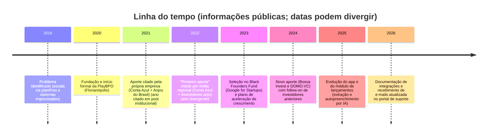

# PlayBPO: análise profunda e rigorosa da plataforma brasileira para BPO Financeiro

## Resumo executivo

A PlayBPO é uma plataforma SaaS vertical (software específico de nicho) voltada à operação de **BPO Financeiro** — com foco explícito em **gestão de tarefas**, **padronização de rotinas**, **comunicação com o cliente** e **integrações com ERPs financeiros**, incluindo recursos recentes de **lançamentos com apoio de IA** (extração e autopreenchimento a partir de documentos anexados). citeturn11view0turn11view2turn16view0

Do ponto de vista de mercado, a empresa se posiciona como ferramenta “sob medida” para escritórios e operadores de BPO Financeiro, reforçando diferenciais como **rentabilidade por cliente**, **indicadores em tempo real**, **cofre de senhas**, canal próprio de comunicação (app + web + e-mail) e integração com ERPs. citeturn11view0turn2view0turn15view0turn15view1

Em termos de **maturidade técnica e compliance**, há sinais positivos (hospedagem em **entity["company","Amazon Web Services","cloud computing"]**, criptografia e hash “para informações mais essenciais”, políticas LGPD, uso de provedores especializados como **entity["company","Zendesk","customer support saas"]** e **entity["company","Iugu","payments brazil"]). citeturn26view0turn14view0turn8view2  
Ao mesmo tempo, existem lacunas e riscos relevantes para um produto que lida com dados financeiros sensíveis: **ausência de SLA público de disponibilidade**, ambiguidades e erros textuais na política de privacidade (até um trecho com “PlayBOY” e referência à **entity["company","HostGator","web hosting"]**), e integrações que, em certos casos, exigem o uso de **credenciais (e-mail/senha) do cliente** para autenticação no ERP — um padrão que aumenta a superfície de risco e merece evolução para modelos mais robustos (OAuth, tokens revogáveis, “service accounts”, etc.). citeturn26view0turn12view0turn13view3

Recomendações estratégicas prioritárias:
- **Segurança e compliance**: elevar o padrão de governança (SSO/SAML, MFA, auditoria detalhada, gestão de segredos, DPA/subprocessadores, retenção/eliminação alinhada à LGPD) e corrigir inconsistências documentais. citeturn26view0turn14view0turn8view4  
- **Integrações**: migrar integrações baseadas em senha para **fluxos tokenizados** e ampliar o “hub” com APIs/Webhooks formais e observabilidade de integrações. citeturn12view0turn13view1turn11view2  
- **Produto/GTM**: transformar a vantagem vertical (rotinas BPO + app cliente + IA para documentos) em uma proposta “enterprise-ready” e fortalecer canais (parcerias com ERPs, comunidades contábeis e educação via PlayBPO School). citeturn9view0turn11view0turn9view2

## Visão geral da empresa e contexto

A própria PlayBPO descreve a origem do “problema” em 2016, quando seu cofundador identificou a dificuldade de escalar a operação sem uma ferramenta robusta; posteriormente, a empresa teria sido fundada em 2020 por **entity["people","José Marques","ceo playbpo"]** e **entity["people","Lázuli Santos","cto playbpo"], em entity["city","Florianópolis","Santa Catarina, Brazil"]. citeturn9view1turn8view0

Em materiais institucionais, a empresa afirma operar em todo o Brasil e apresenta métricas agregadas de uso (por exemplo, milhões de tarefas concluídas, milhares de empresas/usuários e volume de comunicações), mas esses números são **autorreportados** (não são auditados publicamente nas fontes analisadas). citeturn11view0turn9view0turn9view1

Sobre estrutura societária/identificação: a política de privacidade e páginas institucionais publicam **CNPJ** e endereço de contato, reforçando que se trata de uma operação formalizada (PLAY BPO SOFTWARE LTDA). citeturn26view0turn8view4turn8view0

### Linha do tempo



As principais âncoras factuais desse timeline vêm do “Sobre nós” (contexto 2016/2020), do post institucional sobre investimento (2023 e menção a investimento anterior) e da matéria do entity["organization","SC Inova","startup media santa catarina"] (aportes e 2024), além do histórico de atualizações no suporte. citeturn9view1turn8view0turn9view2turn15view0turn11view2turn12view0

### Fundadores, tamanho e funding

- Fundadores/liderança: a empresa se atribui a fundação a José Marques (CEO) e Lázuli Santos (CTO). citeturn8view0turn9view1turn9view2  
- Tamanho (headcount): **não encontrado de forma verificável e estável** nas fontes abertas acessadas neste levantamento (há indícios indiretos via vagas, mas não um número oficial padronizado). citeturn20view0turn18view0  
- Funding:  
  - Selecionada no **entity["organization","Black Founders Fund","google for startups initiative"] (iniciativa do entity["company","Google","technology company"] for Startups) — valores não divulgados. citeturn8view0  
  - Investimentos anteriores: a própria empresa menciona aporte em 2021 com entity["company","Conta Azul","erp financial brazil"] e entity["organization","Anjos do Brasil","angel investor network brazil"]; já o SC Inova descreve o “primeiro aporte” em 2022. **Há divergência de ano** entre as fontes. citeturn8view0turn9view2  
  - Em 2024, o SC Inova relata aporte (valores não divulgados) de entity["company","Bossa Invest","venture capital brazil"] e entity["company","DOMO.VC","venture capital brazil"], com follow-on de investidores anteriores e menção à entity["organization","Rede de Investidores Anjo de Santa Catarina","angel network sc brazil"]. citeturn9view2  

## Modelo de negócio, segmentos e go-to-market

A PlayBPO opera como **SaaS B2B**, declarando ser uma plataforma de gestão de tarefas para BPO Financeiro e oferecendo teste grátis (5 dias, sem cartão) e planos com cobrança recorrente. citeturn11view0turn1view0

### Segmentos-alvo e ICP

As fontes analisadas convergem para um ICP (perfil de cliente ideal) composto por:
- **Empresas e profissionais que prestam BPO Financeiro** (operadores/gestores). citeturn11view0turn8view0turn9view2  
- **Empresas contábeis** como público-alvo relevante (pela capacidade de incorporar BPO ao portfólio), segundo a mídia regional. citeturn9view2  
- O modelo também prevê “Leads” que consomem materiais gratuitos (webinars, conteúdos) e depois migram para contratação, explicitado na política de privacidade (definição de lead e coleta de dados para nutrição). citeturn26view0turn10search4  

### Canais de aquisição e expansão

Os mecanismos de GTM com evidência pública incluem:
- **Inbound + educação**: blog, materiais, webinars e a PlayBPO School como braço educacional (cursos, trilhas e oferta de conteúdo). citeturn10search4turn9view0turn11view0  
- **Inside sales e CS**: presença de “Falar com vendas/Agendar demonstração”, e menções explícitas a gerente de sucesso em fluxos do suporte (ex.: habilitação de funcionalidades “PRO” e orientação por CS). citeturn11view0turn12view1turn12view2  
- **Eventos/propriedade de comunidade**: o site institucional afirma ter criado um evento anual (PlayBPO Summit) para o setor, como estratégia de construção de categoria e comunidade. citeturn11view0  

## Produto e UX

A PlayBPO descreve sua proposta como estrutura em “três pilares” — **gestão**, **operação** e **comunicação** — visando reduzir retrabalho, padronizar rotinas e dar visibilidade gerencial. citeturn2view0turn11view0

image_group{"layout":"carousel","aspect_ratio":"16:9","query":["Financeiro na Mão PlayBPO screenshots","PlayBPO plataforma dashboard screenshot","PlayBPO gestor de tarefas BPO Financeiro interface"],"num_per_query":1}

### Módulos e funcionalidades centrais

Com base nas páginas institucionais e no help center, os módulos mais bem documentados são:

**Gestão do BPO (visão gerencial)**
- Rentabilidade por cliente e ajuste de mensalidades com base no tempo investido. citeturn11view0turn9view1  
- Monitoramento de produtividade e andamento das entregas em sistema centralizado. citeturn11view0turn9view1  

**Operação (workflow)**
- Programação de tarefas recorrentes, checklists e “fluxos inteligentes”. citeturn11view0turn10search7  
- Registro e padronização de regras e processos por cliente. citeturn11view0  

**Comunicação com o cliente (multicanal “operacional”, não contact center)**
- Centralização de comunicações e envio/recebimento de documentos via **app**, **web** e **e-mail**, com histórico e indicadores. citeturn11view0turn15view1turn15view0  
- Notificações automáticas ao cliente quando solicitações são atendidas. citeturn11view0  

**Cofre de senhas e controle de acesso**
- A plataforma promove a centralização e controle de acesso a senhas de sistemas financeiros (um ponto crítico em BPO). citeturn11view0turn2view0  

**Lançamentos e integração ERP com apoio de IA**
- Lançamentos de contas a pagar diretamente da PlayBPO para ERPs (ex.: Omie e Conta Azul), a partir da área de comunicação e anexos, com campos puxados do ERP onde aplicável. citeturn12view1turn12view2  
- Extração de planilha (Excel) configurada para importação no ERP (“campos dinâmicos”), ligada a solicitações do app. citeturn16view0  
- Autopreenchimento por IA de campos do formulário de lançamento a partir de anexos (faturas, comprovantes, NFs), com revisão humana antes do lançamento final. citeturn11view2turn11view0  

### Onboarding e adoção

Em preço e comunicação, há indícios de uma estratégia de onboarding “rápido” (teste de 5 dias, sem cartão) e venda assistida (demonstração). citeturn11view0turn1view0  
Nos planos, há menção a **taxa única de onboarding** (sem valor explícito), o que sugere implantação orientada e/ou setup assistido em clientes pagantes. citeturn1view0

### Apps mobile e web

A PlayBPO mantém o app “Financeiro na mão” (cliente final) em iOS e Android:
- iOS: listado como gratuito, voltado à comunicação e envio de documentos entre clientes e operadores que usam o sistema. citeturn8view3  
- Android: 5 mil+ downloads, com declaração de criptografia “em trânsito” e informação de que não é possível excluir dados (declaração do desenvolvedor na ficha do app). citeturn8view4  
O help center documenta o uso do app para envio de documentos e ressalta requisitos operacionais (por exemplo, assunto ou descrição obrigatórios para envio). citeturn8view2

## Arquitetura, integrações e stack

### Arquitetura funcional de alto nível

A documentação pública não descreve uma arquitetura interna (microserviços vs. monólito, bancos, filas, etc.), mas permite mapear **componentes** e **integrações** com clareza suficiente para uma visão de arquitetura funcional.

```mermaid
flowchart LR
  subgraph Usuarios["Usuários"]
    G[Gestor (BPO)]
    O[Operador (BPO)]
    C[Cliente final]
  end

  subgraph Canais["Canais de interação"]
    W[Web app / Dashboard]
    M[App mobile 'Financeiro na Mão']
    E[Entrada por e-mail (token@playbpo.com.br)]
  end

  subgraph Core["Core PlayBPO (SaaS)"]
    T[Workflow de tarefas / checklists / recorrência]
    COM[Central de comunicações + anexos + histórico]
    KPI[Indicadores / rentabilidade / timesheet]
    VAULT[Cofre de senhas + permissões]
    AI[IA: extração/autopreenchimento de lançamentos]
    INT[Camada de integrações]
  end

  subgraph Externos["Sistemas e provedores externos"]
    ERP1[ERPs (Conta Azul / Omie / Nibo / Bom Controle)]
    CAL[Google Agenda (calendar.readonly)]
    PAY[Gateway de pagamento]
    CS[Helpdesk/Support]
    MKT[Marketing/CRM]
    CLOUD[Cloud/hosting]
  end

  G --> W
  O --> W
  C --> M
  C --> E

  W --> T
  W --> COM
  W --> KPI
  W --> VAULT

  M --> COM
  E --> COM

  COM --> AI --> INT --> ERP1
  INT --> CAL
  INT --> PAY
  Core --> CS
  Core --> MKT
  Core --> CLOUD
```

A base factual desse diagrama vem da descrição do produto (tarefas, comunicação, indicadores, cofre de senhas, IA), do help center (fluxos de integração e e-mail), e da política de privacidade (provedores e hospedagem). citeturn11view0turn15view1turn15view0turn11view2turn12view0turn13view1turn26view0turn14view0

### Integrações e métodos de autenticação

As integrações com ERPs aparecem como diferencial central (“integrar-se com os principais ERPs do mercado”). citeturn11view0turn2view0  
O help center detalha que os métodos variam por ERP:

- **entity["company","Omie","erp brazil"]**: integração por **APP_KEY e APP_SECRET** (chaves de API) copiadas do painel do ERP e coladas na PlayBPO. citeturn13view1  
- **entity["company","Nibo","financial management platform for accountants"]**: integração via credenciais + vínculo automático por CNPJ (a PlayBPO “verifica os CNPJs registrados no sistema financeiro e vincula”). citeturn13view3  
- **Conta Azul PRO** (plano PRO referido no suporte): fluxo descrito como autenticação semelhante a login no Conta Azul, incluindo menção a 2FA (quando habilitado no ERP). Esse padrão sugere dependência de credencial e sessão/autenticação — o que é funcional, mas mais sensível do ponto de vista de segurança e governança do que um OAuth típico. citeturn12view0turn12view2  

Além disso, o suporte descreve exportação de Excel “no formato do ERP” (Conta Azul, Nibo, Omie) para importação e aceleração de lançamentos — uma estratégia híbrida (integração direta + integração por arquivo) que tende a aumentar compatibilidade em cenários onde APIs mudam ou são limitadas. citeturn16view0turn12view1

### Recebimento de e-mails (canal operacional)

A PlayBPO documenta a habilitação de recebimento de e-mails “diretamente na plataforma”, com geração de endereço por cliente no padrão `token@playbpo.com.br` e instruções para encaminhamento (Gmail/Outlook) para alimentar a central de comunicações. citeturn15view1turn15view0

### Stack e sinais técnicos

Não há documentação pública de stack completa, mas vagas técnicas apontam fortemente para:
- Backend em **PHP** e frontend em **JavaScript**. citeturn20view0  
- Uso de **Angular e/ou React** no front, além de preocupação explícita com usabilidade/performance e consumo de APIs REST. citeturn20view1  
- Diferenciais desejáveis incluem “cloud e Docker”, sugerindo uso de conteinerização e operação em nuvem (coerente com a hospedagem em AWS descrita na política de privacidade). citeturn20view0turn26view0  

## Segurança, LGPD e confiabilidade

### Privacidade, LGPD e subprocessadores

A política de privacidade declara conformidade com a **LGPD (Lei 13.709/2018)**, descreve coleta (inclusive IP, navegador, cookies), base legal (consentimento, legítimo interesse, execução de contrato etc.), e informa que dados de cartão não são armazenados pela PlayBPO (ficam com a plataforma de pagamento). citeturn26view0

A mesma política lista provedores com potencial acesso a dados, citando explicitamente **Amazon AWS**, **entity["company","Iugu","payments brazil"], **entity["company","RD Station Marketing","marketing automation brazil"] e **entity["company","LeadLover","marketing automation platform"]. citeturn26view0  
Também descreve **integração com Google Agenda** com permissão `calendar.readonly` e finalidade de evitar conflitos de agenda, sem compartilhamento a terceiros. citeturn26view0

Do ponto de vista de governança institucional, a política cita papel do encarregado e fiscalização da **entity["organization","Autoridade Nacional de Proteção de Dados","brazil data protection authority"] (ANPD), inclusive com possibilidade de relatório de impacto quando requisitado. citeturn26view0

### Controles de segurança declarados

A PlayBPO afirma adotar medidas técnicas/gestão e declara que os dados “ficarão criptografados” e “informações mais essenciais” com “código hash”, além de reconhecer limites inerentes de segurança na internet. citeturn26view0  
No Android, a ficha do app declara criptografia em trânsito e afirma não haver compartilhamento de dados com terceiros (declaração do desenvolvedor). citeturn8view4

### Sinais de fragilidade documental (risco de confiança)

Há inconsistências relevantes na política de privacidade:
- referência a “PlayBOY” em um trecho sobre AWS;  
- menção de que, ao aceitar a política, o usuário concorda com a da entity["company","HostGator","web hosting"], apesar de a mesma política afirmar hospedagem na AWS;  
- mistura de redação e termos que sugerem “colar e adaptar” sem revisão jurídica final.

Esses pontos **não provam** falha técnica, mas enfraquecem a confiança — especialmente para clientes maiores e para riscos LGPD. citeturn26view0

### Confiabilidade e SLAs

Não há, nas fontes analisadas, um **SLA público de uptime** (disponibilidade) do serviço. O que existe de forma objetiva e publicada é uma **política de SLA de suporte**, com prazos de resolução por prioridade (ex.: “Urgente” até 8 horas úteis; “Alta” até 48 horas úteis; etc.), contados em horas úteis. citeturn14view0

Esse modelo é útil para backoffice, mas para clientes mais críticos pode ser insuficiente sem:
- SLOs/SLA de disponibilidade,  
- transparência de janelas de manutenção/incidentes,  
- e mecanismos de status page/post-mortems (não evidenciados publicamente).

## Mercado, posicionamento e concorrência

### Posicionamento

A PlayBPO se posiciona como plataforma exclusiva para BPO Financeiro “feita sob medida”, com promessa de economizar tempo (até 60% segundo mensagem comercial) e com diferenciação por integração ERP, indicadores e canal direto com o cliente (app/web/e-mail). citeturn11view0turn10search0

Na prática, isso a coloca em uma categoria híbrida:
- **“practice ops”/workflow vertical** (típico de softwares para escritórios),  
- + **hub operacional de documentos e lançamentos** com integração (típico de automação financeira).

### Benchmarks e concorrentes relevantes

Para comparar de forma útil, faz sentido separar concorrentes em dois grupos:

**Horizontais (generalistas de workflow/automação)**  
- entity["company","Pipefy","workflow management platform brazil"]: automação de processos com IA, API, permissões, SSO/MFA e opção de white label (no Enterprise). citeturn25search3  
- entity["company","ClickUp","productivity platform"] e entity["company","monday.com","work management platform"]: gestão de trabalho com automações, integrações e recursos enterprise; ambos com pricing por assento. citeturn24view0turn23view1  

**Verticais para firmas contábeis/financeiras (internacionais)**  
- entity["company","Karbon","accounting practice management software"]: “practice management” para firmas contábeis com e-mail integrado, time tracking/budget, billing e automações (em planos superiores). citeturn25search1  

**Benchmarks brasileiros adjacentes (ecossistema contábil)**  
- Domínio Processos (Soluções entity["company","Thomson Reuters","information services and software company"]): módulo de tarefas contábeis integrado ao Domínio. citeturn22search13  
- A aquisição da Gestta pela Thomson Reuters e integração ao ecossistema Domínio reforça que “gestão de tarefas + atendimento” é uma tese forte no mercado contábil (base de comparação estratégica, mesmo que não seja BPO financeiro puro). citeturn22search5  

### Gráfico comparativo

O gráfico abaixo é um **modelo analítico**, construído a partir de evidências de documentação pública (marcando a presença de capabilities). Ele **não mede qualidade**, apenas cobertura de capacidades relevantes para gestão/automação e operação com cliente. citeturn11view0turn26view0turn24view0turn23view1turn25search3turn25search1

### Tabela de comparação de preços

Observação importante: PlayBPO precifica por **número de empresas (CNPJs) geridas**, enquanto plataformas como monday/ClickUp/Karbon tendem a precificar por **usuário (assento)**. Logo, a comparação abaixo é mais “estrutural” do que um “TCO real” (custo total). citeturn1view0turn24view0turn23view1turn25search1turn25search3

| Plataforma | Modelo de cobrança publicado | Faixa/âncora de preço publicada (mar/2026) | Observações |
|---|---|---|---|
| PlayBPO | Assinatura mensal/anual por **qtde de empresas** + extras | Free (R$0) até Avançado (R$239,90/mês) + R$15/mês por empresa extra (mensal) | Taxa única de onboarding é mencionada, sem valor público. citeturn1view0 |
| entity["company","Pipefy","workflow management platform brazil"] | Starter grátis; planos pagos “Falar com vendas”; cobrança por usuário (no Business) | **Sem preço público** no site pt-BR (Business/Enterprise sob consulta) | Recursos citam API, permissões, SSO/MFA e white label (Enterprise). citeturn25search3 |
| entity["company","ClickUp","productivity platform"] | Per user/month (com anual) | Unlimited: US$7/usuário/mês (anual); Business: US$12/usuário/mês (anual) | Preços e principais recursos (dashboards, workload, permissões) são exibidos na página. citeturn24view0turn24view4 |
| entity["company","monday.com","work management platform"] | Per seat/month (com anual) | Basic: US$9/assento/mês; Standard: US$12; Pro: US$19 (anual) | Também declara apps iOS/Android e recursos enterprise (permissões, segurança). citeturn23view1 |
| entity["company","Karbon","accounting practice management software"] | Per user/month (anual ou mensal) | Team: US$59/usuário/mês (anual) ou US$79 (mensal); Business: US$89 (anual) ou US$99 (mensal) | Solução focada em firmas contábeis; custo por assento é alto para mercados emergentes. citeturn25search1 |

### Tabela de comparação de features

Legenda: **Sim (doc.)** = evidenciado na documentação consultada; **Parcial** = existe indício por features adjacentes; **Não evidenciado** = não apareceu nas fontes analisadas (o que não prova ausência). citeturn11view0turn15view1turn11view2turn24view0turn23view1turn25search3turn25search1

| Capacidade | PlayBPO | entity["company","Pipefy","workflow management platform brazil"] | entity["company","ClickUp","productivity platform"] | entity["company","monday.com","work management platform"] | entity["company","Karbon","accounting practice management software"] |
|---|---|---|---|---|---|
| Tarefas/recorrência/checklists | Sim (doc.) | Sim (doc.) | Sim (doc.) | Sim (doc.) | Sim (doc.) |
| Automação de workflow | Sim (doc.) | Sim (doc.) | Sim (doc.) | Sim (doc.) | Sim (doc.) |
| Integração ERP de lançamentos (financeiro) | **Sim (doc.)** | Não evidenciado | Não evidenciado | Não evidenciado | Parcial (integrações “industry”) |
| IA aplicada a documentos (extração/autopreenchimento) | **Sim (doc.)** | Parcial (IA e “Document Understanding”) | Parcial (camada de IA opcional) | Sim (doc.) (AI credits) | Não evidenciado |
| Comunicação com cliente (app/web/e-mail nativo) | **Sim (doc.)** | Parcial (forms/solicitações; sem app cliente evidenciado) | Parcial (guest/email) | Parcial (guest + apps mobile) | Parcial (e-mail + lembretes) |
| Indicadores de rentabilidade por cliente | Sim (doc.) | Não evidenciado | Não evidenciado | Não evidenciado | Parcial (budget reporting; não “rentabilidade do BPO”) |
| Segurança enterprise (SSO/MFA/permissões avançadas) | Parcial (criptografia/hash; “cofre de senhas”; SSO/MFA não explícitos) | Sim (doc.) | Sim (doc.) | Sim (doc.) | Não evidenciado (no pricing oficial) |

## Análise estratégica e recomendações

### SWOT

| | **Fatores internos** | **Fatores externos** |
|---|---|---|
| **Favorável** | **Forças**: verticalização clara para BPO Financeiro; integração operacional com ERPs; canal do cliente (app + e-mail) e IA aplicada ao fluxo de documentos/lançamentos; precificação por carteira (CNPJs) com usuários ilimitados, o que reduz atrito de adoção em operações com muitos operadores. citeturn11view0turn1view0turn11view2turn15view1 | **Oportunidades**: expansão do mercado de BPO Financeiro e da “produtização” do serviço; parcerias estratégicas com ERPs e ecossistema contábil; crescer para o mid-market com governança e integrações mais robustas; capturar “categoria” via educação e evento anual. citeturn11view0turn9view0turn9view2 |
| **Desfavorável** | **Fraquezas**: gaps de transparência enterprise (SLA de uptime, certificações, SSO/MFA, status page); riscos e fricções em integrações baseadas em credenciais; documentação de privacidade com inconsistências que podem travar venda para clientes mais exigentes e aumentar risco regulatório LGPD. citeturn14view0turn12view0turn26view0 | **Ameaças**: plataformas horizontais (Pipefy/monday/ClickUp) podem “comoditizar” workflow e automação; players do ecossistema contábil (Domínio Processos) podem capturar demanda adjacente; mudanças de políticas/limites em APIs de ERPs podem quebrar integrações e elevar custo de manutenção; aumento de exigência de compliance (LGPD e auditorias) para operações financeiras. citeturn10search20turn22search13turn25search3turn23view1 |

### Recomendações estratégicas

**Produto**
1) Consolidar o posicionamento como “plataforma operacional do BPO Financeiro” com módulos claramente empacotados: (i) operação/tarefas, (ii) comunicação e intake (app + e-mail), (iii) lançamentos e conciliação/ERP, (iv) gestão (rentabilidade, SLAs, produtividade). A base já existe; o ganho é reduzir ambiguidade e tornar a evolução previsível. citeturn11view0turn16view0turn1view0  
2) Evoluir recursos “tipo CRM” para o contexto do BPO: pipeline de onboarding de novos clientes, health score por cliente, alertas de risco (pendências recorrentes, atrasos, baixa responsividade). Hoje há indicadores operacionais, mas o salto é conectar operação ↔ retenção/expansão. citeturn11view0turn9view1  
3) Expandir IA com foco pragmático: classificação automática de anexos (tipo/fornecedor), sugestão de categoria/centro de custo, detecção de duplicidade e alertas de fraude simples (ex.: boleto repetido). A empresa já tem “autopreenchimento” e extração; a próxima camada deve ser “controle e qualidade”. citeturn11view2turn12view1  

**Tecnologia e integrações**
4) Prioridade alta: reduzir dependência de **credenciais do cliente** em integrações (quando aplicável) e migrar para modelos de autenticação mais seguros (OAuth/tokens revogáveis, chaves por aplicação, escopos mínimos, rotação). O help center mostra que parte do ecossistema já opera com API keys (Omie), então há caminho. citeturn13view1turn12view0turn13view3  
5) Definir uma “camada de integrações” como produto: logs de integração por cliente, monitoramento de falhas, reprocessamento seguro, e contratos de compatibilidade. Os próprios Termos alertam que integrações podem ser afetadas por mudanças em APIs/fornecedores — isso precisa virar capacidade de resiliência. citeturn10search20turn16view0  
6) Formalizar APIs e webhooks externos (mesmo que inicialmente limitados) para permitir ecossistema: parceiros de automação, BI, RPA e integrações com ferramentas contábeis. Isso ajuda a defender contra plataformas horizontais. (Não há evidência pública de uma API aberta hoje; portanto, trata-se de recomendação.) citeturn11view0turn10search20  

**Segurança, privacidade e confiabilidade**
7) Revisão completa e profissional da política de privacidade e materiais de compliance (incluindo lista de subprocessadores, DPA, termos claros de retenção/eliminação). Do jeito que está, há inconsistências que podem virar barreira comercial e risco regulatório. citeturn26view0  
8) Implementar e comunicar controles enterprise: MFA/SSO, trilhas de auditoria (quem viu/baixou/anexou), gestão de chaves/segredos e opcionais de data retention. Mesmo que tecnicamente existam, **não aparecem de forma clara** nas fontes públicas — e venda enterprise depende de clareza. citeturn26view0turn14view0turn20view0  
9) Publicar uma visão de confiabilidade: uptime target, janelas de manutenção e um status page. O SLA de suporte existe, mas não substitui disponibilidade. citeturn14view0turn11view0  

**GTM e pricing**
10) Tornar o pricing mais “operacional”: além de CNPJs, oferecer tiers por volume de transações/documentos processados (especialmente IA), e eventualmente por “módulos” (lançamentos + IA como add-on). Isso alinha valor com custo e evita “subsidizar” heavy users em planos baixos. citeturn1view0turn11view2  
11) Fortalecer canal via ERPs e ecossistema contábil (parcerias e co-marketing), aproveitando o efeito rede e reduzindo CAC. A própria tese de mercado do SC Inova aponta contabilidades como público-alvo forte. citeturn9view2turn11view0  
12) Usar a PlayBPO School como motor de PLG/upsell: trilhas de certificação que travem padrões operacionais (SOPs) em cima do produto, criando lock-in positivo e diferencial difícil de copiar por ferramentas horizontais. citeturn9view0turn11view0